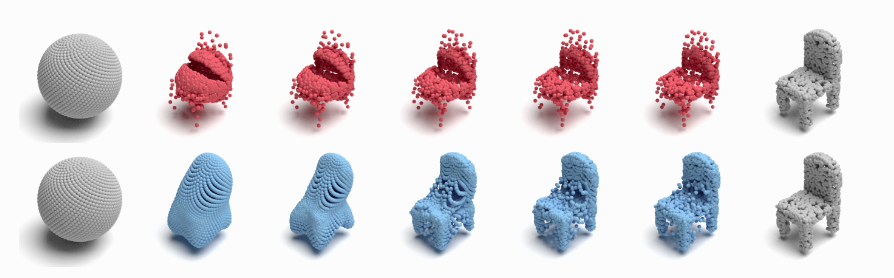

##### Table of Content

1. [Introduction](#point-set-distances-for-learning-representations-of-3D-point-clouds)
1. [Getting Started](#getting-started)
    - [Datasets](#datasets)
    - [Installation](#installation)
1. [Experiments](#experiments)


# Point-set Distances for Learning Representations of 3D Point Clouds
This repository contains the implementation of our [paper](https://arxiv.org/abs/2102.04014). In particular, we release code for training a point cloud autoencoder network with different point-set distances and testing the autoencoder for classification, reconstruction, registration and generation. 

|  |
|:--:|
| *Morph a sphere into a chair by optimizing two different loss functions: Chamfer (top, red) and SWD (bottom, blue).*|

Details of the model architecture and experimental results can be found in [our following paper](https://arxiv.org/abs/2102.04014).

```
@InProceedings{Nguyen2021PointSetDistances,
  title={Point-set Distances for Learning Representations of 3D Point Clouds},
  author={Nguyen, Trung and Pham, Quang-Hieu and Le, Tam and Pham, Tung and Ho, Nhat and Hua, Binh-Son},
  booktitle={Proceedings of the IEEE/CVF International Conference on Computer Vision (ICCV)},
  year={2021}
}
```
**Please CITE** our paper whenever our model implementation is used to help produce published results or incorporated into other software.

## Getting Started

### Datasets
#### ShapeNet Core with 55 categories (refered from <a href="http://www.merl.com/research/license#FoldingNet" target="_blank">FoldingNet</a>.)
```bash
  cd dataset
  bash download_shapenet_core55_catagories.sh
```
#### ModelNet40
```bash
  cd dataset
  bash download_modelnet40_same_with_pointnet.sh
```
#### ShapeNet Chair
```bash
  cd dataset
  bash download_shapenet_chair.sh
``` 
#### 3DMatch
```bash
  cd dataset
  bash download_3dmatch.sh
```
### Installation:
The code is based on Pytorch. It has been tested with Python 3.6.9, PyTorch 1.2.0, CUDA 10.0 on Ubuntu 18.04.  
Other dependencies:
* Tensorboard 2.3.0
* Open3d 0.7.0
* Tqdm 4.46.0 

To compile CUDA kernel for CD/EMD loss:
```
cd metrics_from_point_flow/pytorch_structural_losses/
make clean
make
```
## Experiments
### Autoencoder
To train an autoencoder: 
<!-- In the file `config.json`, set `loss` to be one of [`swd`, `emd`, `chamfer`, `asw`, `msw`, `gsw`] and set `autoencoder` to be one of [`pointnet`, `pcn`], then run: -->
```
python train.py --config="config.json" \
                --logdir="logs/" \
                --data_path="dataset/shapenet_core55/shapenet57448xyzonly.npz"

# or in short, you can run
bash train.sh
```
To test reconstruction:
```
python reconstruction/reconstruction_test.py  --config="reconstruction/config.json" \
                                              --logdir="logs/" \
                                              --data_path="dataset/modelnet40_ply_hdf5_2048/"

# or in short, you can run
bash reconstruction/test.sh
```
### Semi-supervised classification
<!-- To generate latent codes of the training set of ModelNet40 and save them into a file: <br>
In the file `classification/preprocess_config.json`, change `root` and `save_folder` to be `train`, and run:
```
bash classification/preprocess.sh
```
To generate latent codes of the test set of ModelNet40 and save them into a file: <br>
In the file `classification/preprocess_config.json`, change `root` and `save_folder` to be `test`, and run: -->
To generate latent codes of the train/test sets of ModelNet40 and save them into files:
```
python classification/preprocess_data.py  --config='classification/preprocess_train.json' \
                                          --logdir="logs/" \
                                          --data_path="dataset/modelnet40_ply_hdf5_2048/train/"

python classification/preprocess_data.py  --config='classification/preprocess_test.json' \
                                          --logdir="logs/" \
                                          --data_path="dataset/modelnet40_ply_hdf5_2048/test/"

# or in short, you can run
bash classification/preprocess.sh
```
To get classification results:
```
python classification/classification_train.py --config='classification/class_train_config.json' \
                                              --logdir="logs/"

python classification/classification_test.py  --config='classification/class_test_config.json' \
                                              --logdir="logs/"

# or in short, you can run
bash classification/classify_train_test.sh
```
### Registration
To preprocess 3DMatch dataset:
```
python registration/preprocess_data.py  --config='registration/preprocess_config.json' \
                                        --logdir='logs/' \
                                        --data_path='dataset/home1'
python registration/preprocess_data.py  --config='registration/preprocess_config.json' \
                                        --logdir='logs/' \
                                        --data_path='dataset/home2'
python registration/preprocess_data.py  --config='registration/preprocess_config.json' \
                                        --logdir='logs/' \
                                        --data_path='dataset/hotel1'
python registration/preprocess_data.py  --config='registration/preprocess_config.json' \
                                        --logdir='logs/' \
                                        --data_path='dataset/hotel2'
python registration/preprocess_data.py  --config='registration/preprocess_config.json' \
                                        --logdir='logs/' \
                                        --data_path='dataset/hotel3'
python registration/preprocess_data.py  --config='registration/preprocess_config.json' \
                                        --logdir='logs/' \
                                        --data_path='dataset/kitchen'
python registration/preprocess_data.py  --config='registration/preprocess_config.json' \
                                        --logdir='logs/' \
                                        --data_path='dataset/lab'
python registration/preprocess_data.py  --config='registration/preprocess_config.json' \
                                        --logdir='logs/' \
                                        --data_path='dataset/study'

# or in short, you can run
bash registration/preprocess.sh
```
To generate transformations into log files:
```
python registration/registration_test.py  --config='registration/registration_config.json' \
                                          --logdir='logs/model/home1/'
python registration/registration_test.py  --config='registration/registration_config.json' \
                                          --logdir='logs/model/home2/'
python registration/registration_test.py  --config='registration/registration_config.json' \
                                          --logdir='logs/model/hotel1/'
python registration/registration_test.py  --config='registration/registration_config.json' \
                                          --logdir='logs/model/hotel2/'
python registration/registration_test.py  --config='registration/registration_config.json' \
                                          --logdir='logs/model/hotel3/'
python registration/registration_test.py  --config='registration/registration_config.json' \
                                          --logdir='logs/model/kitchen/'
python registration/registration_test.py  --config='registration/registration_config.json' \
                                          --logdir='logs/model/lab/'
python registration/registration_test.py  --config='registration/registration_config.json' \
                                          --logdir='logs/model/study/'

# or in short, you can run
bash registration/register.sh
```
To evaluate log files, follow the instruction in the `Evaluation` section on this [page](https://3dmatch.cs.princeton.edu/#geometric-registration-benchmark).

### Generation
To generate latent codes of train/test sets of ShapeNet Chair and save them into files:
<!-- In the file `generation/preprocess_config.json`, change `root` and `save_folder` to be `train` (or `test`), and run: -->
```
python generation/preprocess.py  --config='generation/preprocess_train.json' \
                                 --logdir="logs/" \
                                 --data_path="dataset/shapenet_chair/train.npz"

python generation/preprocess.py  --config='generation/preprocess_test.json' \
                                 --logdir="logs/" \
                                 --data_path="dataset/shapenet_chair/test.npz"

# Or in short, you can run
bash generation/preprocess.sh
```
To train the generator:
```
python generation/train_latent_generator.py --seed=1 \
                                            --logdir="logs/"

# or in short, you can run
bash generation/train_latent_generator.sh
```
To test the generator:
```
python generation/test_generation.py  --config='generation/test_generation_config.json' \
                                      --logdir="logs/"
                                      
# or in short, you can run
bash generation/test_generation.sh
```